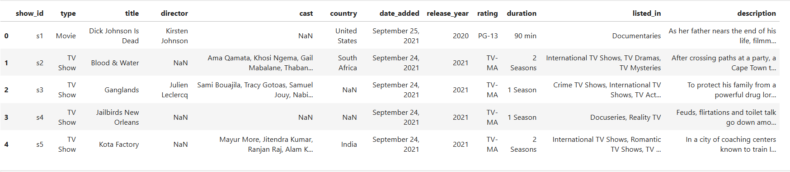
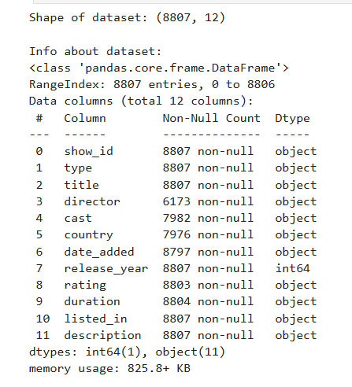
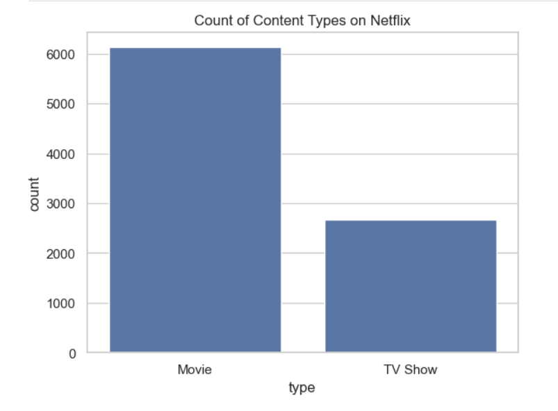
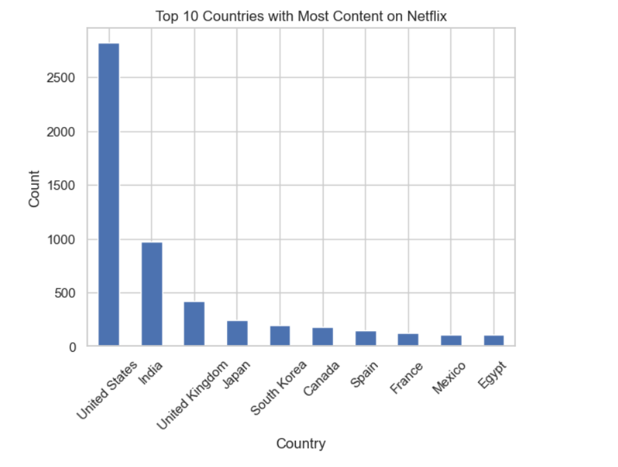
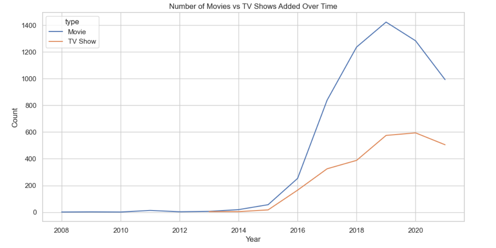

# CodeAlpha Internship - Task 2: Exploratory Data Analysis (EDA)

This project is part of the 1-month Data Analytics Internship offered by **CodeAlpha**.

## 📊 Project Objective
Perform Exploratory Data Analysis (EDA) on Netflix's dataset to uncover hidden patterns, understand content distribution, and identify trends or inconsistencies.

## 📁 Dataset Information
- **Name:** Netflix Titles Dataset
- **Source:** [Kaggle](https://www.kaggle.com/datasets/shivamb/netflix-shows)
- **File Used:** `netflix_titles.csv`
- **Content:** Title information including type, director, cast, country, release year, rating, duration, and date added.

## 🧰 Tools & Libraries Used
- Python 3
- Pandas
- Matplotlib
- Seaborn
- Jupyter Notebook (via Anaconda)

## 📌 Key Analysis Performed
- Movies vs TV Shows Count
- Top 10 Countries with Most Netflix Content
- Content Addition Trends Over the Years
- Year-wise Additions of Movies and TV Shows
- Missing Value Detection
- Data Type Checking and Transformation

## 📸 Screenshots

### 🔹 Dataset Preview  

### 🔹 Dataset Info  

### 🔹 Count of Content Types  

### 🔹 Top 10 Countries with Most Content  

### 🔹 Movies vs TV Shows Over Time  

## 📂 Files Included
- `CodeAlpha_Task2_Exploratory_Data_Analysis_Netflix.ipynb` – Jupyter notebook with complete EDA code and outputs
- `netflix_titles.csv` – Raw dataset
- `screenshots/` – Folder containing output visuals

## 🏁 Outcome
This task helped develop practical skills in:
- Handling real-world datasets
- Identifying trends and data insights
- Using Python for data analysis

---

✅ **Successfully Completed for CodeAlpha Internship – June 2025**
